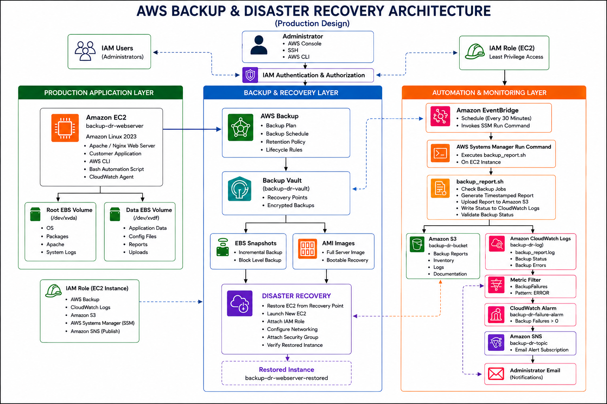

# AWS Backup & Disaster Recovery Automation for Amazon EC2

A production-inspired AWS Backup and Disaster Recovery solution that automates EC2 backup verification, monitoring, alerting, scheduled health checks, and disaster recovery using native AWS services.

---

# Project Overview

This project demonstrates the implementation of an automated Backup and Disaster Recovery (DR) solution for an Amazon EC2 instance using AWS native services.

The solution includes:

- Automated EC2 backups using AWS Backup
- Backup report generation using a Bash automation script
- Report storage in Amazon S3
- Centralized logging with Amazon CloudWatch Logs
- Backup failure detection using CloudWatch Metric Filters
- Alarming using Amazon CloudWatch Alarms
- Email notifications using Amazon SNS
- Scheduled automation using Amazon EventBridge Scheduler and AWS Systems Manager
- Disaster Recovery validation through EC2 restoration

---

# Architecture

> Replace the image below with your architecture diagram.

<p align="center">
    
</p>

---

# Objectives

- Automate EC2 backup creation
- Secure backups inside AWS Backup Vault
- Generate automated backup health reports
- Store reports in Amazon S3
- Detect backup failures automatically
- Notify administrators using Amazon SNS
- Schedule backup verification
- Demonstrate Disaster Recovery through EC2 restoration

---

# Features

- Automated Backup Management
- Scheduled Backup Verification
- Timestamped Backup Reports
- Amazon S3 Report Storage
- CloudWatch Log Monitoring
- Metric Filter-based Failure Detection
- CloudWatch Alarm Monitoring
- Amazon SNS Email Notifications
- Disaster Recovery Validation
- IAM Role-based Authentication

---

# AWS Services Used

| Service | Purpose |
|----------|---------|
| Amazon EC2 | Production Server |
| Amazon EBS | Persistent Storage |
| AWS Backup | Backup Management |
| Backup Vault | Recovery Point Storage |
| Amazon S3 | Backup Report Storage |
| Amazon CloudWatch Logs | Centralized Logging |
| CloudWatch Metric Filter | Backup Failure Detection |
| CloudWatch Alarm | Monitoring |
| Amazon SNS | Email Notifications |
| Amazon EventBridge Scheduler | Scheduled Automation |
| AWS Systems Manager | Remote Script Execution |
| IAM | Secure Access Management |
| AWS CLI | Backup Status Retrieval |

---

# Repository Structure

```text
AWS-Backup-Disaster-Recovery-Project/
│
├── README.md
├── LICENSE
│
├── architecture/
│   └── aws-backup-dr-architecture.png
│
├── scripts/
│   └── backup_report.sh
│
├── screenshots/
│   ├── 01-ec2-instance.png
│   ├── 02-backup-plan.png
│   ├── 03-backup-vault.png
│   ├── 04-recovery-point.png
│   ├── 05-s3-bucket.png
│   ├── 06-cloudwatch-logs.png
│   ├── 07-metric-filter.png
│   ├── 08-cloudwatch-alarm.png
│   ├── 09-sns-topic.png
│   ├── 10-eventbridge-scheduler.png
│   ├── 11-systems-manager.png
│   └── 12-restored-instance.png
│
└── docs/
    ├── HLD.md
    ├── LLD.md
    └── implementation-guide.md
```

---

# Project Workflow

```text
Administrator
      │
      ▼
EventBridge Scheduler
      │
      ▼
AWS Systems Manager
      │
      ▼
backup_report.sh
      │
      ├────────────► AWS Backup
      │                  │
      │                  ▼
      │           Backup Vault
      │                  │
      │                  ▼
      │           Recovery Point
      │                  │
      │                  ▼
      │            Restore EC2
      │
      ├────────────► Amazon S3
      │
      └────────────► CloudWatch Logs
                           │
                           ▼
                    Metric Filter
                           │
                           ▼
                   CloudWatch Alarm
                           │
                           ▼
                      Amazon SNS
                           │
                           ▼
                  Email Notification
```

---

# Implementation Summary

The project was implemented in the following stages:

1. Provisioned an Amazon EC2 instance.
2. Created an AWS Backup Vault.
3. Configured an AWS Backup Plan.
4. Protected the EC2 instance using the backup plan.
5. Generated recovery points.
6. Developed a Bash automation script for backup verification.
7. Uploaded backup reports to Amazon S3.
8. Configured CloudWatch Logs.
9. Created a Metric Filter to detect backup failures.
10. Configured a CloudWatch Alarm.
11. Integrated Amazon SNS for email notifications.
12. Automated script execution using EventBridge Scheduler and AWS Systems Manager.
13. Restored the EC2 instance from a recovery point.
14. Verified successful disaster recovery.

---

# Disaster Recovery Validation

The Disaster Recovery process was successfully validated by restoring the protected EC2 instance from an AWS Backup recovery point.

Validation included:

- Successful EC2 restoration
- Verification of application files
- Verification of backup reports
- Verification of IAM Role functionality
- Verification of AWS CLI access
- Verification of Amazon S3 connectivity

---

# Monitoring and Alerting

The monitoring pipeline implemented in this project is shown below.

```text
CloudWatch Logs
      │
      ▼
Metric Filter
      │
      ▼
CloudWatch Alarm
      │
      ▼
Amazon SNS
      │
      ▼
Administrator Email
```

Whenever the backup verification script logs a backup failure, the Metric Filter increments the `BackupFailures` metric. The CloudWatch Alarm transitions to the **ALARM** state and Amazon SNS sends an email notification to the administrator.

---

# Screenshots

| Screenshot | Description |
|------------|-------------|
| EC2 Instance | Amazon EC2 instance |
| Backup Plan | AWS Backup Plan |
| Backup Vault | Backup Vault |
| Recovery Point | Recovery Point |
| Amazon S3 | Backup Reports |
| CloudWatch Logs | Log Collection |
| Metric Filter | Backup Failure Detection |
| CloudWatch Alarm | Alarm Configuration |
| Amazon SNS | Notification Topic |
| EventBridge Scheduler | Scheduled Automation |
| AWS Systems Manager | Run Command |
| Restored EC2 Instance | Disaster Recovery Validation |

---

# Future Improvements

- Cross-Region Backup
- Cross-Account Disaster Recovery
- Infrastructure as Code using Terraform
- AWS Backup Audit Manager integration
- CloudWatch Dashboards
- Slack and Microsoft Teams notifications
- Automated Disaster Recovery testing
- Cost optimization using Lifecycle Policies

---

# Learning Outcomes

This project demonstrates practical implementation of:

- AWS Backup
- Amazon EC2
- Amazon EBS
- Amazon S3
- Amazon CloudWatch
- Amazon SNS
- Amazon EventBridge Scheduler
- AWS Systems Manager
- IAM Roles and Policies
- AWS CLI
- Bash Automation
- Disaster Recovery

---

# Author

Omkar Sutrave

GitHub: https://github.com/omkar47code

---

# License

This project is intended for educational and portfolio purposes.
